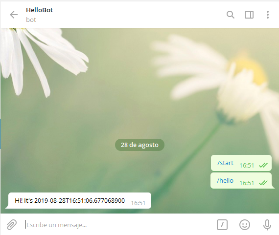

# HelloBot

Telegram Bot example in Java language that says `Hi!` if you said `/hello`.



## Compile 

```bash
mvn compile
```

## Run

```bash
mvn exec:java -Dexec.mainClass="fvarrui.telegram.bot.Main" -Dtoken=<token> -Dusername=<username>
```

## Create your bot 

Follow this [link](https://telegram.me/botfather) to register your own bot.
